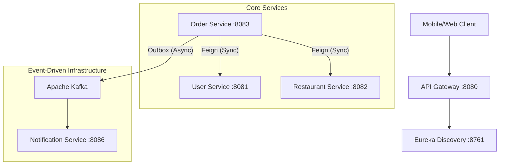

# Food Delivery Microservices Backend

A production-grade, distributed food delivery platform built with a focus on high availability, eventual consistency, and observability. This project demonstrates advanced microservices patterns including the **Transactional Outbox**, **API Gateway**, and **Distributed Tracing**.

## 🛠 Tech Stack

### Core Frameworks
*   **Java 17** (LTS)
*   **Spring Boot 3.2.0**
*   **Spring Cloud 2023.0.0** (Eureka, Gateway, OpenFeign, Resilience4j)

### Persistence & Messaging
*   **MySQL 8.0**: Database-per-service pattern for strict data isolation.
*   **Flyway**: Automated database schema migrations.
*   **Redis**: High-performance metadata caching and session management.
*   **Apache Kafka (Confluent 7.5.0)**: Event-driven communication using the Transactional Outbox pattern.

### Observability (Phase 6)
*   **Zipkin & Micrometer**: Distributed tracing across service boundaries.
*   **Spring Boot Actuator**: Health monitoring and metrics collection.

---

## 🏗 Architecture Overview



### Key Architectural Patterns
1.  **Transactional Outbox**: Ensures atomicity between database updates and Kafka message publishing, solving the "Dual-Write" problem.
2.  **API Gateway**: Single entry point for clients, handling routing and (planned) JWT validation.
3.  **Database-per-Service**: Each microservice owns its own MySQL schema to ensure independent scalability and deployments.
4.  **Service Discovery**: Netflix Eureka manages dynamic service registration and client-side load balancing.

---

## 📈 Implementation Progress

| Feature | Status | Phase |
| :--- | :---: | :---: |
| Service Discovery (Eureka) | ✅ | Core |
| API Gateway Routing | ✅ | Core |
| Core Service Skeleton (Order, User, Rest) | ✅ | Core |
| Feign ↔ Controller Alignment | 🏗️ | Phase 1 |
| Transactional Outbox Pattern | ⏳ | Phase 3 |
| Notification Service Consumer | ⏳ | Phase 4 |
| Resilience4j Circuit Breakers | ⏳ | Phase 5 |
| Distributed Tracing (Zipkin) | ⏳ | Phase 6 |
| JWT Security (Gateway) | ⏳ | Phase 7 |

---

## 🚀 Local Development

### Prerequisites
*   Docker & Docker Compose
*   Java 17
*   Maven 3.8+

### Setup Infrastructure
```bash
docker-compose up -d
```
This starts MySQL, Redis, Kafka, Zookeeper, and Zipkin.

### Running Services
Services should be started in the following order:
1.  **Discovery Service**: `mvn spring-boot:run -pl discovery-service`
2.  **API Gateway**: `mvn spring-boot:run -pl api-gateway`
3.  **Core Services**: (Order, User, Restaurant, etc.)

---

## 📜 License
This project is for educational and portfolio purposes.
