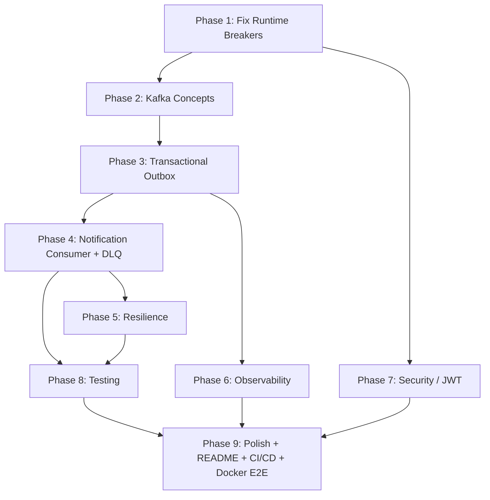

# Food Delivery Backend — Production-Grade Plan (No Time Constraints)

## Codebase Audit Summary

26 issues found across the codebase. Categorized list for reference:

| # | Issue | Severity | Phase |
|---|-------|----------|-------|
| A1 | Feign ↔ Controller route mismatch (outlets: `@PathVariable` vs `@RequestParam`) | 🔴 Runtime | 1 |
| A2 | Feign ↔ Controller route mismatch (users: `/users/{id}` vs `/users/get-by-id?userId=`) | 🔴 Runtime | 1 |
| A3 | `currentStatus` never set — FK constraint violation on order save | 🔴 Runtime | 1 |
| A4 | `OutletDto` field mismatch — Feign expects `name`, controller returns `street/locality/city` | 🔴 Runtime | 1 |
| A5 | `api_tests.http` uses invalid UUIDs (`out123`, `item456`) | 🔴 Runtime | 1 |
| A6 | Missing `@Valid` on Controller `@RequestBody` — payloads bypass validation | 🔴 Runtime | 1 |
| A7 | Unhandled Idempotency Collision — returns 500 instead of existing resource | 🔴 Runtime | 1 |
| A8 | Network calls (Feign) inside `@Transactional` — risk of connection pool exhaustion | 🟡 Performance | 1 |
| B1 | Zero Kafka code — no spring-kafka, no producer, no consumer, no outbox entity | 🔴 Missing | 3 |
| B2 | Notification Service is empty shell | 🔴 Missing | 4 |
| B3 | No tests anywhere | 🔴 Missing | 8 |
| C1 | `RuntimeException` everywhere instead of domain exceptions | 🟡 Quality | 9 |
| C2 | `GlobalExceptionHandler` in wrong package (`exception` vs `com.fooddelivery.commons.exception`) | 🟡 Quality | 9 |
| C3 | `OrderItem.orderItemId` — `@UuidGenerator` vs manual set conflict | 🟡 Quality | 9 |
| C4 | Hardcoded prices and "In a real app" comments in OrderMapper | 🟡 Quality | 9 |
| D1 | `db_flywayscripts/` folder confusing — two versions of schemas | 🟢 Polish | 9 |
| D2 | `README.md` references nonexistent `PROJECT_PROGRESS.md`, `helper.md` | 🟢 Polish | 9 |
| D3 | Docker Compose `version: '3.8'` deprecated | 🟢 Polish | 9 |
| D4 | Dockerfile comment says `MODULE_NAME`, arg is `SERVICE_NAME` | 🟢 Polish | 9 |
| D5 | Port inconsistency — order-service local profile `8084` vs docker-compose `8083` | 🟢 Polish | 9 |
| E1 | Zipkin in docker-compose but zero tracing in any service | 🟡 Missing | 6 |
| E2 | No CI/CD | 🟡 Missing | 9 |
| F1 | Auditing lacks Identity — `createdBy`/`updatedBy` missing from entities | 🟡 Quality | 7 |
| F2 | N+1 Feign calls — Lack of caching (Redis) for static metadata (Outlets/Users) | 🟢 Performance | 9 |
| F3 | Hard deletes on domain entities — no `@SQLDelete` / `@Where` soft-delete logic | 🟡 Quality | 9 |
| F4 | Fragmented Configuration — lack of centralized management/profiles strategy | 🟢 Polish | 9 |

---

## Phase 1: Fix Runtime Breakers & Core Logic

> **Goal**: Make the existing order creation flow actually work end-to-end and follow best practices.

### Fix A1 + A2: Feign ↔ Controller Route Alignment
*Align controllers to match REST convention used by Feign clients.*

### Fix A3: Set `currentStatus` in Order Creation
*Ensure `OrderStatus` is persisted before the `Order` to avoid FK violations.*

### Fix A6: Enable Request Validation
*Add `@Valid` to `@RequestBody` in `OrderController` and others to ensure DTO constraints are enforced.*

### Fix A7: Handle Idempotency Exceptions
*Catch `DataIntegrityViolationException` in `OrderService` for the `(user_id, idempotency_key)` constraint. Return existing order DTO instead of 500.*

### Fix A8: Refactor Transactional Boundaries
*Move Feign calls (`userClient`, `restaurantClient`) outside the `@Transactional` block in `OrderService.createOrder` to prevent holding DB connections during network I/O.*

---
...
---

## Phase 7: Security (JWT) & Identity Auditing

> **Goal**: API Gateway validates JWT tokens. Services trust the gateway. Entities track "who" changed them.

### JWT Implementation
...

### Fix F1: Identity Auditing
*Implement `AuditorAware<String>` to extract the `X-User-Id` from the security context and populate `createdBy`/`updatedBy` fields in all JPA entities.*

---
...
---

## Phase 9: Polish & Production Hardening

> **Goal**: Make the repo look like a senior engineer's work, not an AI-generated project.

### Fix F2: Metadata Caching (Redis)
*Introduce Redis to cache `UserDto` and `OutletDto` responses in the Order Service to reduce Feign latency and inter-service traffic.*

### Fix F3: Soft Delete Strategy
*Implement soft-delete across `User`, `Outlet`, and `Brand` entities using Hibernate `@SQLDelete` and `@Where` annotations.*

### Fix F4: Centralized Config Strategy
*Unify `application.yml` structures and move shared configurations (Kafka, Zipkin, DataSource defaults) into a common base or profile.*

### Code Quality Sweep
...

### Fix A4: OutletDto Field Mismatch

The Order Service's `OutletDto` expects `{outletId, name, isActive, isOpen}`. But `OutletResponseDTO` has `{outletId, brandId, street, city, ...}` — no `name` field at all.

| File | Change |
|------|--------|
| Modify: `OutletController.java` | Add a new `@GetMapping("/{outletId}")` that returns an `ApiResponse<OutletDto>` instead of `OutletResponseDTO`. Or add `name` field to the Outlet entity and response |
| Modify: `restaurant-service/entity/Outlet.java` | Verify the entity has a `name` field |

### Fix A5: Fix `api_tests.http`

Replace all non-UUID values with valid UUIDs. Add test payloads that match the schema.

### Verification
```
mvn compile -pl order-service,restaurant-service,user-service -am
```
All three must pass.

---

## Phase 2: Kafka Concepts (Learning Session — No Code)

> **Goal**: Understand every Kafka concept before writing a single line of Kafka code.

This is a conversation. I ask questions, connect to your Spring Boot experience, you explain back.

### Concept Map

```
Session 1: Why async?
├── 1. What problem does Kafka solve?
│   └── "Why not just call Notification Service via Feign?"
│   └── Connect to: RestTemplate, Feign, @Async — what you already know
│
├── 2. Producer → Topic → Consumer
│   └── What is a topic? What is a consumer group?
│   └── Connect to: JMS queues, RabbitMQ (if seen)
│
└── 3. At-least-once vs exactly-once delivery
    └── What happens when consumer crashes mid-processing?
    └── Connect to: database transactions — what you know about atomicity

Session 2: Why outbox?
├── 4. The Dual-Write Problem
│   └── orderRepo.save() + kafkaTemplate.send() — what breaks?
│   └── Walk through 3 failure scenarios
│
├── 5. Transactional Outbox Pattern
│   └── Same DB transaction writes order + outbox row
│   └── Separate poller reads outbox → publishes to Kafka
│   └── Draw the diagram on paper
│
└── 6. Idempotency and the Inbox Pattern
    └── Consumer receives same message twice — how to handle?
    └── Inbox table with unique event_id
    └── Connect to: database unique constraints — what you already know

Session 3: Kafka internals (enough to defend in interview)
├── 7. Partitions and ordering guarantees
│   └── Why we use orderId as partition key
│   └── What ordering does Kafka guarantee within a partition?
│
├── 8. Consumer groups and rebalancing
│   └── What happens when you add a second notification-service instance?
│
└── 9. Offset management
    └── What is a committed offset?
    └── Why uncommitted offsets cause redelivery (at-least-once)
```

**Rule**: We don't move to Phase 3 until you can draw the outbox pattern on paper and explain the dual-write problem in one sentence.

---

## Phase 3: Transactional Outbox (Order Service)

> **Goal**: Order creation writes both the order and a Kafka outbox event in a single DB transaction. A separate poller publishes to Kafka.

### New Files

| File | Purpose |
|------|---------|
| `entity/OutboxEvent.java` | JPA entity → `outbox_events` table (already exists in schema) |
| `repository/OutboxEventRepository.java` | Query: `findPendingEvents()` — status=PENDING, nextRetryAt <= now |
| `event/OrderCreatedEvent.java` | Payload DTO: orderId, userId, outletId, orderNumber, totalAmount, createdAt |
| `event/OutboxPoller.java` | `@Scheduled(fixedDelay = 5000)` — reads PENDING → `KafkaTemplate.send()` → marks PUBLISHED |
| `config/KafkaProducerConfig.java` | KafkaTemplate bean with JSON serializer |

### Modified Files

| File | Change |
|------|--------|
| `pom.xml` | Add `spring-kafka` dependency |
| `service/OrderService.java` | After `orderRepository.save()` — **same `@Transactional`** — create OutboxEvent, serialize OrderCreatedEvent to JSON, save to outbox |
| `OrderServiceApplication.java` | Add `@EnableScheduling` |
| `application.yml` | Add `spring.kafka.bootstrap-servers` |
| `application-docker.yml` | Kafka bootstrap: `kafka:29092` |
| `application-local.yml` | Kafka bootstrap: `localhost:9092` |

### The Critical Code Path (What Makes This Interview-Worthy)

```
@Transactional   ← ONE transaction boundary
public OrderResponse createOrder(request) {
    // 1. Validate user + outlet (Feign)
    // 2. Build order entity
    // 3. Calculate pricing
    // 4. Save order                          ← DB write 1
    // 5. Create OutboxEvent (ORDER_CREATED)
    // 6. Save outbox event                   ← DB write 2 (SAME transaction)
    // 7. Return response
}
// If app crashes here, both writes committed. Poller picks up outbox later.
// If app crashes between 4 and 6, both writes roll back. No orphan order.
```

### OutboxPoller Logic

```
@Scheduled(fixedDelay = 5000)
public void pollAndPublish() {
    List<OutboxEvent> pending = repo.findPendingEvents();
    for each event:
        try:
            kafkaTemplate.send(event.destination, event.partitionKey, event.payload)
            event.status = PUBLISHED
            event.publishedAt = now
        catch:
            event.attempts++
            event.lastErrorMessage = error
            event.nextRetryAt = now + exponentialBackoff(attempts)
            if attempts >= maxAttempts:
                event.status = DISCARDED
        save(event)
```

### Verification
```
mvn compile -pl order-service -am
```
Grep: `outboxEventRepository.save` appears inside a method annotated with `@Transactional`.

---

## Phase 4: Notification Consumer + Dead Letter Queue

> **Goal**: Notification Service consumes `order.created` events from Kafka, checks idempotency via inbox table, processes the event, handles failures with DLQ.

### New Files (notification-service)

| File | Purpose |
|------|---------|
| `entity/NotificationEventInbox.java` | JPA entity: inboxSeqId, eventId (unique), sourceService, eventType, processedAt |
| `repository/EventInboxRepository.java` | Method: `existsByEventId(String)` — the idempotency check |
| `event/OrderCreatedEvent.java` | Same DTO as order-service (deserialization target) |
| `consumer/OrderEventConsumer.java` | `@KafkaListener(topics = "order.created")` with inbox check |
| `config/KafkaConsumerConfig.java` | Consumer factory with JSON deserializer, DLQ error handler |
| `resources/db/migration/V1.0.1__create_event_inbox.sql` | Inbox table DDL |

### Modified Files

| File | Change |
|------|--------|
| `pom.xml` | Add: spring-kafka, spring-boot-starter-web, spring-boot-starter-data-jpa, mysql-connector-j, lombok, flyway |
| `application.yml` | Kafka consumer config, MySQL datasource, Flyway |
| `application-docker.yml` | Kafka bootstrap, MySQL URL |
| `NotificationServiceApplication.java` | Verify annotations |

### Consumer Logic

```
@KafkaListener(topics = "order.created", groupId = "notification-service")
public void handleOrderCreated(OrderCreatedEvent event) {
    String eventId = event.getOrderId(); // or a dedicated event UUID

    // IDEMPOTENCY CHECK
    if (inboxRepository.existsByEventId(eventId)) {
        log.info("Duplicate event {}, skipping", eventId);
        return;
    }

    // PROCESS (create notification job, log, etc.)
    log.info("Processing order.created for order {}", event.getOrderId());

    // SAVE TO INBOX (marks as processed)
    inboxRepository.save(new NotificationEventInbox(eventId, "ORDER_SERVICE", "ORDER_CREATED"));
}
```

### Dead Letter Queue

When a message fails processing N times, Kafka's `DefaultErrorHandler` routes it to `order.created.DLT` (dead letter topic). We configure:

| Config | Value |
|--------|-------|
| Max retries | 3 |
| Backoff | 1s, 2s, 4s (exponential) |
| DLT topic | `order.created.DLT` |
| DLT handler | Log the failed message + event ID for manual investigation |

### Verification
```
mvn compile -pl notification-service -am
```
Grep: `@KafkaListener` on `order.created`, `existsByEventId` call before processing.

---

## Phase 5: Resilience

> **Goal**: Services handle downstream failures gracefully instead of crashing.

### Feign Circuit Breakers (Order Service)

What happens today when User Service is down during order creation? `FeignException` propagates up, returns 500 to the client. No retry, no fallback, no useful error message.

| File | Change |
|------|--------|
| `order-service/pom.xml` | Add `spring-cloud-starter-circuitbreaker-resilience4j` |
| `RestaurantClient.java` | Add `@CircuitBreaker(name = "restaurantService", fallbackMethod = "...")` or use Feign + Resilience4j integration |
| `UserClient.java` | Same pattern |
| New: `client/fallback/RestaurantClientFallback.java` | Returns meaningful error DTO when restaurant-service is unreachable |
| New: `client/fallback/UserClientFallback.java` | Same for user-service |
| `application.yml` | Resilience4j config: sliding window, failure rate threshold, wait duration |

### Kafka Producer Resilience (OutboxPoller)

The poller already handles failures with retry + backoff. We add:
- `KafkaTemplate` configured with `retries=3`, `acks=all` for durability
- Proper timeout configuration so the poller doesn't hang

### Kafka Consumer Resilience (Notification Service)

Already handled by DLQ in Phase 4.

### What You Can Defend in Interview

> "What happens if Kafka is down when the poller tries to publish?"
>
> The outbox event stays PENDING. The poller increments `attempts` and sets `nextRetryAt` with exponential backoff. It will retry on the next poll cycle. If it exceeds `maxAttempts`, it's marked DISCARDED for manual review. The order itself is already committed — the customer isn't affected.

---

## Phase 6: Observability

> **Goal**: Trace a request from API Gateway through Feign calls and Kafka messages. See it in Zipkin.

### Distributed Tracing (Zipkin)

Zipkin is already in docker-compose but zero services are wired to it.

| File | Change |
|------|--------|
| Each service `pom.xml` | Add `micrometer-tracing-bridge-brave`, `zipkin-reporter-brave` |
| Each service `application.yml` | `management.tracing.sampling.probability: 1.0`, `management.zipkin.tracing.endpoint` |

This gives you trace IDs that flow across:
- HTTP requests through API Gateway
- Feign calls (Order → User, Order → Restaurant)
- Kafka messages (Order producer → Notification consumer)

### Spring Boot Actuator

| File | Change |
|------|--------|
| Each service `pom.xml` | Add `spring-boot-starter-actuator` |
| Each service `application.yml` | Expose health, info, metrics endpoints |

Endpoints you get: `/actuator/health` (readiness/liveness for Docker), `/actuator/info`, `/actuator/metrics`.

### Structured Logging

| File | Change |
|------|--------|
| New: `commons/.../logging/CorrelationIdFilter.java` | Servlet filter that reads/generates `X-Correlation-Id` header, puts it in MDC |
| Each service `application.yml` | Log pattern includes `[traceId=%X{traceId}]` |

### What You Can Defend in Interview

> "How do you debug a failed order in production?"
>
> Every request gets a trace ID. I can search Zipkin by trace ID and see the full journey: API Gateway → Order Service → (Feign to User Service) → (Feign to Restaurant Service) → DB save → Outbox event → Kafka publish → Notification Service consume. Each hop shows latency and errors.

---

## Phase 7: Security (JWT)

> **Goal**: API Gateway validates JWT tokens. Services trust the gateway. Service-to-service calls use internal tokens.

### Architecture

```
Client → [JWT in Authorization header] → API Gateway
    → Validates JWT (signature, expiry, claims)
    → Extracts userId, roles
    → Forwards as X-User-Id, X-User-Roles headers to downstream services
    → Downstream services trust these headers (internal network only)
```

### Implementation

| File | Change |
|------|--------|
| New: `api-gateway/.../filter/JwtAuthFilter.java` | Global filter that validates JWT, extracts claims, sets headers |
| New: `api-gateway/.../config/SecurityConfig.java` | Whitelist public endpoints (register, login) |
| New: `user-service/.../controller/AuthController.java` | `POST /api/v1/auth/login` — validates credentials, returns JWT |
| New: `user-service/.../security/JwtTokenProvider.java` | JWT creation + validation utility |
| Modify: `user-service/pom.xml` | Add `jjwt` dependency |
| Modify: `api-gateway/pom.xml` | Add `jjwt` dependency |
| Modify: `order-service/.../service/OrderService.java` | Read userId from header instead of request body (optional — can keep body for now) |

### What You Can Defend in Interview

> "How does authentication work across services?"
>
> The API Gateway is the single entry point. It validates the JWT, extracts claims, and forwards trusted headers. Downstream services don't validate JWTs themselves — they trust the gateway. Service-to-service calls (Feign) happen on the internal Docker network and include a service-level token.

---

## Phase 8: Testing

> **Goal**: Prove the critical paths work programmatically. Not 100% coverage — targeted tests for interview-defensible claims.

### Unit Tests

| Test | What It Proves | Framework |
|------|---------------|-----------|
| `OrderServiceTest.createOrder_savesOrderAndOutboxEvent` | Both order and outbox event saved in same transaction | JUnit 5 + Mockito |
| `OrderServiceTest.createOrder_rollsBackBothOnFailure` | If outbox save fails, order also rolls back | JUnit 5 + Mockito |
| `OutboxPollerTest.pollAndPublish_marksPublishedOnSuccess` | Happy path: PENDING → PUBLISHED | JUnit 5 + Mockito |
| `OutboxPollerTest.pollAndPublish_retriesOnKafkaFailure` | Kafka down: increments attempts, sets nextRetryAt | JUnit 5 + Mockito |
| `OutboxPollerTest.pollAndPublish_discardsAfterMaxAttempts` | Exceeded retries: PENDING → DISCARDED | JUnit 5 + Mockito |
| `OrderEventConsumerTest.handleOrderCreated_processesNewEvent` | New event processed + saved to inbox | JUnit 5 + Mockito |
| `OrderEventConsumerTest.handleOrderCreated_skipsDuplicate` | Duplicate event detected via inbox, skipped | JUnit 5 + Mockito |
| `PricingServiceTest.calculateOrderTotals` | Math is correct: items + tax + delivery fee = total | JUnit 5 |

### Integration Tests (Testcontainers)

| Test | What It Proves | Infra |
|------|---------------|-------|
| `OrderOutboxIntegrationTest` | Create order via HTTP → outbox event exists in DB → poller publishes to Kafka → notification consumer receives it → inbox row exists | Testcontainers: MySQL + Kafka |

This single integration test proves the entire outbox → Kafka → inbox flow end-to-end. It's the strongest test you can show an interviewer.

### Dependencies

| File | Add |
|------|-----|
| `order-service/pom.xml` | `spring-boot-starter-test`, `testcontainers`, `testcontainers-mysql`, `testcontainers-kafka` |
| `notification-service/pom.xml` | Same |

### Verification
```
mvn test -pl order-service
mvn test -pl notification-service
```

---

## Phase 9: Polish

> **Goal**: Make the repo look like a senior engineer's work, not an AI-generated project.

### Code Quality Sweep

| # | Fix | Files |
|---|-----|-------|
| C1 | Create exception hierarchy: `BaseServiceException` → `OrderNotFoundException`, `InvalidOrderRequestException`, `ServiceUnavailableException` | New: `order-service/.../exception/` package |
| C2 | Move `GlobalExceptionHandler` to `com.fooddelivery.commons.exception` package | `commons/` |
| C3 | Remove manual `setOrderItemId()` — let `@UuidGenerator` handle it | `OrderMapper.java` |
| C4 | Clean up OrderMapper — replace "In a real app" comments with a proper `DemoPricingStrategy` comment or fetch from request | `OrderMapper.java` |
| D1 | Move `db_flywayscripts/` → `docs/schema-designs/` + add explanatory README | Move folder |
| D2 | Remove dead references to `PROJECT_PROGRESS.md`, `helper.md` from README | `README.md` |
| D3 | Remove `version: '3.8'` from docker-compose | `docker-compose.yml` |
| D4 | Fix Dockerfile comment | `Dockerfile` |
| D5 | Fix port inconsistency | `application-local.yml` |

### Architecture Decision Records (ADRs)

Create `docs/adr/` directory with:

| ADR | Title | Key Point |
|-----|-------|-----------|
| `001-transactional-outbox.md` | Transactional Outbox over Direct Kafka Publish | Dual-write problem, crash scenarios, why polling over CDC |
| `002-uuid-over-bigint.md` | UUID for Cross-Service Identifiers | No coordination, globally unique, shard-friendly |
| `003-check-over-enum.md` | CHECK Constraints over MySQL ENUMs | ALTER TABLE on ENUM rewrites table file, CHECK does not |
| `004-database-per-service.md` | Database-per-Service Pattern | No cross-service FKs, independent schema evolution |
| `005-at-least-once-inbox.md` | At-Least-Once Delivery with Inbox Idempotency | Simpler than exactly-once, audit trail, portable |
| `006-api-gateway-jwt.md` | JWT Validation at Gateway, Trust Downstream | Single validation point, no token re-validation per service |

### Portfolio-Grade README

Sections:
1. **Title + tech badges** — Java 17, Spring Boot 3.2, Kafka, MySQL, Docker, Resilience4j, Zipkin
2. **Architecture diagram** — Mermaid showing full system: Gateway → Eureka → Services, Outbox → Kafka → Consumer, Zipkin tracing
3. **What's Implemented** — honest scope with ✅ and 🔲
4. **Key Design Decisions** — links to ADRs
5. **Event Flow** — step-by-step: order creation → outbox → Kafka → notification → inbox
6. **How to Run** — docker-compose up, seed data commands, curl examples
7. **API Reference** — key endpoints
8. **Testing** — how to run tests, what the integration test proves
9. **Schema Design** — link to `docs/schema-designs/`

### CI/CD (GitHub Actions)

| File | Purpose |
|------|---------|
| `.github/workflows/ci.yml` | On push to `main`: checkout, setup Java 17, `mvn compile`, `mvn test` |

Simple but shows the repo is maintained and tests pass on every push.

### Docker Validation + End-to-End Test

Full sequence:
1. `docker-compose up -d` — all infrastructure + all services
2. Register user → get user ID
3. Register brand → register outlet → get outlet ID
4. Create order with valid user + outlet IDs
5. Verify in MySQL: order exists, outbox event exists with status PUBLISHED
6. Verify notification service logs: "Processed order.created for order {id}"
7. Verify notification inbox: row exists with event ID
8. Send duplicate → verify: "Duplicate event, skipping"
9. Open Zipkin UI → search by trace ID → see full request flow
10. Kill notification-service → create order → restart notification-service → verify it catches up from Kafka offset

---

## Phase Dependency Graph



Phases 5, 6, and 7 can run in parallel after their prerequisites are done. Phase 8 needs 3, 4, and 5 to be complete (we're testing those features). Phase 9 is the final pass.

---

## Git Strategy

One commit per logical change. We push after each phase. Commit messages follow conventional format:
```
fix: align Feign client routes with controller endpoints
feat: implement transactional outbox pattern in order service
feat: add Kafka consumer with inbox idempotency to notification service
feat: add Resilience4j circuit breakers to Feign clients
feat: add Zipkin distributed tracing across all services
feat: add JWT authentication at API gateway
test: add unit tests for outbox and consumer flows
test: add Testcontainers integration test for full event flow
docs: add architecture decision records
docs: rewrite README with architecture diagram and honest scope
ci: add GitHub Actions compile and test workflow
```

---

## Open Question

> [!IMPORTANT]
> **Security depth**: The JWT plan above is functional but basic. Do you want to go deeper — refresh tokens, role-based access control (CUSTOMER vs RESTAURANT_ADMIN vs DELIVERY_PARTNER), or is the current Gateway-validates-JWT approach enough for the resume?
